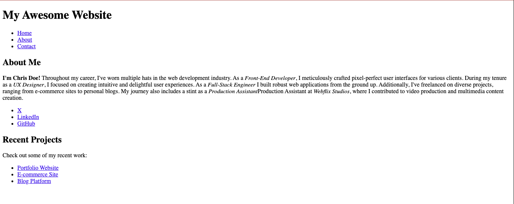

# Semantic HTML Elements Lab 2 - Try it Together

## Description 📄
In this Try It Together activity, you'll be code builders! Now that you have a refactored semantic HTML codebase, why not go a little further by adding some semantic styling and a few more sections. 

---

## Developer Objectives 📋

1. **Bold Intro:** Make Chris Doe's name stand out.
2. **Enhanced About Me:** Add details to Chris' career journey.
3. **Highlight Expertise:** Emphasize key roles using semantic tags.
4. **Organize Content:** Nest sections for better structure.
5. **Showcase Projects:** Create a "Recent Projects" section with an unordered list.

---

## ToDo list ✅
**Attention**: When you complete a task, put an `x` in the middle of the brackets to mark it off your ToDo list.

1. [ ] Navigate to the `index.html` file. 
2. [ ] On line 23, make the copy `I'm Chris Doe!` bold wrapping the copy in the correct semantic HTML tag. Remember how the screen reader will read the tag.
3. [ ] After the `I'm Chris Doe` copy, paste the following copy to make the paragraph tag more robust: `Throughout my career, I've worn multiple hats in the web development industry. As a Front-End Developer, I meticulously crafted pixel-perfect user interfaces for various clients. During my tenure as a UX Designer, I focused on creating intuitive and delightful user experiences. As a Full-Stack Engineer I built robust web applications from the ground up. Additionally, I've freelanced on diverse projects, ranging from e-commerce sites to personal blogs. My journey also includes a stint as a Production Assistant at Webflix Studios, where I contributed to video production and multimedia content creation.`
4. [ ] Next, emphasize the following five word pairs using the appropriate sematic HTML tag in the copy above:
   1. [ ] Front-End Developer
   2. [ ] UX Designer
   3. [ ] Full-Stack Engineer
   4. [ ] Production Assistant
   5. [ ] Webflix Studios
      
  Example:
  ```html
<p>Throughout my career, I've worn multiple hats in the web development industry. As a <em>Front-End Developer</em>,</p>
```
5. [ ] Next ,inside the `<main>` container with 1 `<section>` element, put one more `<section>` under the first `<section>`.
6. [ ] Inside the second `<section>` element, put a subheader element with the copy: `Recent Projects`.
7. [ ] Under that, put a paragraph element with the copy: `Check out some of my recent work:`
8. [ ] Now, copy and paste the unordered list in the `About me` section under the last paragraph tag and refactor the copy in the elements as follows:
   1. [ ] Change the first list tag from `X` to `Portfolio Website`.
   2. [ ] Change the second list tag from `LinkedIn` to  `E-commerce Site`.
   3. [ ] Change the third list tag from `GitHub` to `Blog Platform`.

---

🎊 **Fantastic work! You just used AI to refactor HTML to Semantic HTML! 💃🏻🕺🏾** 🎊

---

### Solution codebase 👀
🛑 **Only use this as a reference** 🛑

💾 **Not something to copy and paste** 💾

**Note:**  This lab references a solution file located [here](https://github.com/HackerUSA-CE/sdai-ic-d3-semantic-html-elements-2/blob/solution/index.html) (link not shown).
